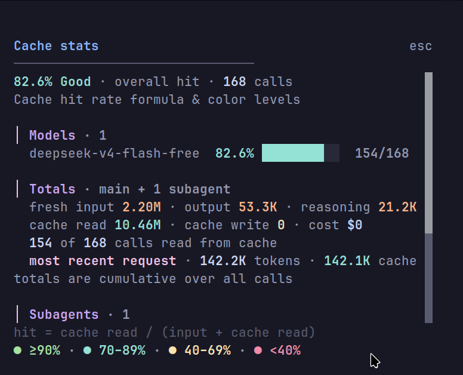

# cache-stats

Very Simple opencode TUI plugin that shows prompt-cache hit rate in a popup dialog.

Open it with the `/cache-stats` command (or the `cache-stats.show` command) while inside a session.



## What it shows

- Overall cache hit % for the active session with a color-coded verdict (`Excellent` / `Good` / `Fair` / `Poor`)
- Per-model breakdown with hit bars, hit %, and cached-call counts
- Totals across the main session including its subagents
- Subagent list with individual hit rates
- The most recent request's context size for comparison

Cache hit rate is computed as:

```
hit = cache read / (input + cache read)
```

Cache write is a one-time priming cost and is excluded from the hit ratio. The plugin also reports how many API calls read from the cache.

## Install

Copy the plugin into your opencode config and register it in `~/.config/opencode/tui.json`:

```json
{
  "$schema": "https://opencode.ai/tui.json",
  "plugin": ["./tui-plugins/cache-stats.tsx"]
}
```

A copy of `tui.json` is kept as `tui.json.example` in this repo.

Restart opencode after changing `tui.json`, then run `/cache-stats` inside a session.

## Files

- `tui-plugins/cache-stats.tsx` — the TUI plugin
- `tui.json.example` — registration config example

## Documentation

- [index](docs/index.md) — overview
- [installation](docs/installation.md) — how to install the plugin
- [usage](docs/usage.md) — how to use the plugin
- [how-it-works](docs/how-it-works.md) — how the plugin collects the data
- [colors](docs/colors.md) — how the plugin colors the rate
- [troubleshooting](docs/troubleshooting.md) — how to fix common errors
