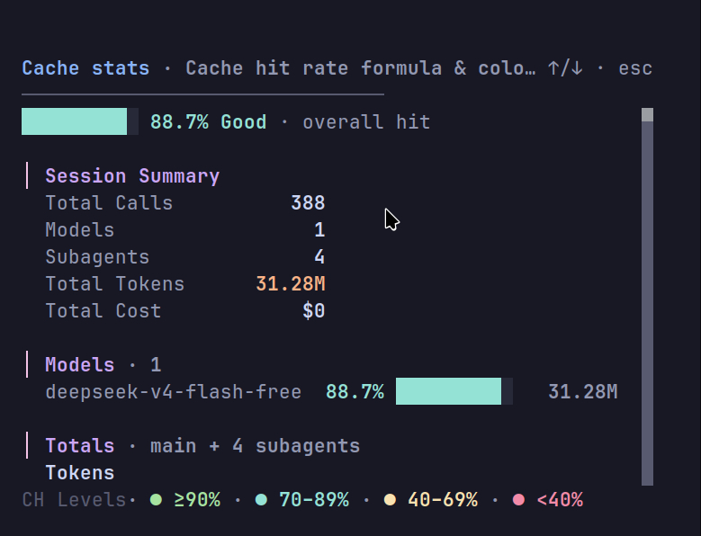
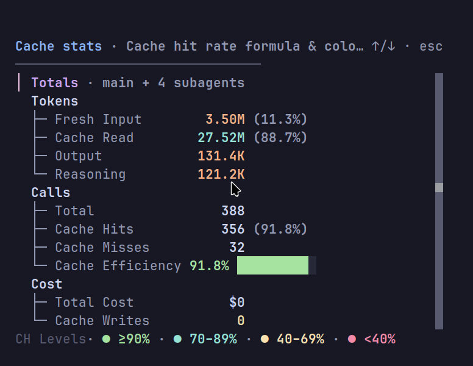
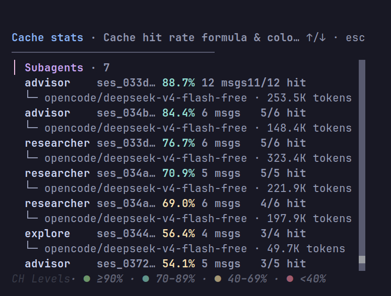

# cache-stats

`cache-stats` is a TUI plugin for [opencode](https://opencode.ai). A TUI is a text user interface. The plugin shows the prompt-cache hit rate of the active session in a popup dialog.

Run the `/cache-stats` command (or the `cache-stats.show` command) inside a session to open the dialog.

| Summary and models | Totals breakdown | Subagents |
|:---:|:---:|:---:|
|  |  |  |

## What it shows

The dialog shows:

- The overall cache hit percentage of the active session. A hit bar and a verdict word (Excellent, Good, Fair, or Poor) show the level.
- A session summary: total calls, model count, subagent count, total tokens, and total cost.
- A per-model breakdown with hit bars, hit percentages, and token totals.
- Grouped totals for tokens, calls, and cost. The totals include percentages, averages per call, and the last request.
- A subagent list with the hit rate of each subagent and the model that each subagent used.

The plugin computes the cache hit rate with this formula:

```
hit = cache read / (input + cache read)
```

A cache write is a one-time priming cost. It is excluded from the hit ratio. The plugin also reports the number of API calls that read from the cache.

## Install

1. Copy the plugin into `~/.config/opencode/tui-plugins/`.
2. Register the plugin in `~/.config/opencode/tui.json`:

```json
{
  "$schema": "https://opencode.ai/tui.json",
  "plugin": ["./tui-plugins/cache-stats.tsx"]
}
```

The repo keeps a copy of `tui.json` as `tui.json.example`.

After you change `tui.json`, restart [opencode](https://opencode.ai). Then run the `/cache-stats` command inside a session.

## Files

- `tui-plugins/cache-stats.tsx` — the TUI plugin
- `tui.json.example` — registration config example

## Documentation

- [index](docs/index.md) — overview
- [installation](docs/installation.md) — how to install the plugin
- [usage](docs/usage.md) — how to use the plugin
- [how-it-works](docs/how-it-works.md) — how the plugin collects the data
- [colors](docs/colors.md) — how the plugin colors the rate
- [troubleshooting](docs/troubleshooting.md) — how to fix common errors
